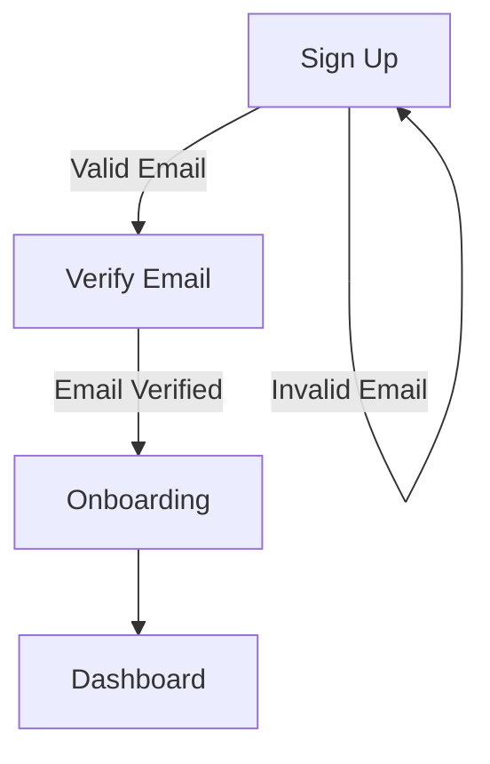

# FRD Creation Instructions & Template

**Last Updated:** February 6, 2026  
**Version:** 1.0

---

## Overview

This document provides a standardized format and structure for creating Functional Requirements Documents (FRDs) across the Starter platform. FRDs document routes, user flows, validation rules, component specifications, and edge cases to ensure consistency between documentation and implementation.

---

## Directory Structure

```
FRD/
├── INSTRUCTIONS.md (this file)
├── README.md (master registry of all FRDs)
├── FRD-Authentication.md (example: multi-route, complex flows)
├── FRD-AdminDashboard.md (example: admin portal)
└── UserManagement/
    ├── README.md (sub-registry with relationship diagram)
    ├── FRD-UserProfile.md (example: component-level detail)
    ├── FRD-RoleManagement.md (example: data model + workflows)
    ├── FRD-PermissionAssignment.md (example: combobox + validations)
    └── FRD-ActivityLog.md (example: audit trail hub)
```

**When to create a subdirectory:**

- Group related features (e.g., all User Management routes → `UserManagement/` folder)
- Create a `README.md` in the subdirectory as a sub-registry linking routes to their FRDs and explaining inter-feature relationships

---

## FRD Header Template

Every FRD must start with this header:

```markdown
# [Feature/Route Name] - Functional Requirements Document (FRD)

**Document Version:** X.X  
**Generated Date:** [Date Created]  
**Last Updated:** [Date of Last Update] (Brief description of change)  
**Project:** Starter Platform

---

## Routes Covered by This FRD

| Route      | Purpose           |
| ---------- | ----------------- |
| `/route-1` | Brief description |
| `/route-2` | Brief description |

---

## Related FRDs

| FRD                          | Relationship              |
| ---------------------------- | ------------------------- |
| [FRD-Name.md](./path/to/FRD) | How this feature connects |
| [FRD-Name.md](./path/to/FRD) | How this feature connects |
```

---

**Header Elements:**

- **Document Version:** Increment when making substantive changes (1.0 → 1.1 for minor, 2.0 for major)
- **Generated Date:** When document was created (never change)
- **Last Updated:** When last modified + brief change description
- **Routes Covered:** List all routes documented in this FRD
- **Related FRDs:** Link to other FRDs this feature depends on or integrates with

---

## Table of Contents Structure

For FRDs include a TOC:

```markdown
## Table of Contents

1. [Overview](#1-overview)
2. [User Stories](#2-user-stories)
3. [Routes & Flows](#3-routes--flows)
4. [Form Specifications](#4-form-specifications)
5. [Validation Rules](#5-validation-rules)
6. [Edge Cases](#6-edge-cases)
7. [Design Specifications](#7-design-specifications)
8. [Revision History](#8-revision-history)
```

---

## Core Sections (Choose Based on Feature Type)

### Section 1: Overview (Always Include)

**Purpose:** High-level feature description and scope.

**Template:**

```markdown
## 1. Overview

### 1.1 Purpose

[2-3 sentence description of what this feature does and who uses it]

### 1.2 Scope

[What is included and what is excluded from this FRD]

### 1.3 Key Concepts

| Concept | Definition |
| ------- | ---------- |
| Term 1  | Definition |
| Term 2  | Definition |
```

---

### Section 2: User Stories (For Auth/Onboarding Flows)

**Purpose:** Describe user motivations and outcomes.

**Template:**

```markdown
## 2. User Stories

### 2.1 [User Type Name]

| ID         | As a... | I want to... | So that... |
| ---------- | ------- | ------------ | ---------- |
| US-CODE-01 | [Actor] | [Action]     | [Benefit]  |
| US-CODE-02 | [Actor] | [Action]     | [Benefit]  |
```

**Guidelines:**

- Use a consistent ID format: `US-[FEATURE]-[NUMBER]`
- Keep "So that" clauses business-focused (not technical)

---

### Section 3: Data Model (For Features with Complex Data)

**Purpose:** Define all entities, fields, and relationships.

**Template:**

```markdown
## 3. [Feature Name] Data Model

| Field      | Type   | Required    | Description                          |
| ---------- | ------ | ----------- | ------------------------------------ |
| fieldName  | String | Yes         | What does this store? Constraints?   |
| dateField  | Date   | Conditional | When required?                       |
| enumField  | Enum   | Yes         | Allowed values: "option1", "option2" |
| references | UUID   | No          | Foreign key to...                    |
```

**Guidelines:**

- For conditional fields, explain the condition
- For enums, list all allowed values
- Include relationships (foreign keys, references)

---

### Section 4: Routes & Flows (For Multi-Route FRDs)

**Purpose:** Document user journeys across routes.

**Template:**

````markdown
## 4. Authentication Routes

### 4.1 Sign Up Flow

**Entry Route:** `/auth/sign-up`


````

**Route Details:**

| Route                | Trigger             | Next Route                        | Validation                   |
| -------------------- | ------------------- | --------------------------------- | ---------------------------- |
| `/auth/sign-up`      | User enters email   | → `/auth/verify-email` (if valid) | Email format, length         |
| `/auth/verify-email` | User enters token   | → `/welcome` (if valid)           | Token expiration, uniqueness |
| `/welcome`           | User completes form | → `/dashboard`                    | All required fields          |

---

### Section 5: Component/Form Specifications (For UI Components)

**Purpose:** Define exact UI structure, layout, and behavior.

**Template:**

```markdown
## 5. [Component Name] Dialog

### 5.1 Dialog Specifications

| Attribute  | Specification                                |
| ---------- | -------------------------------------------- |
| Title      | "[Dialog Title]"                             |
| Dimensions | 750px width × 700px height (max 90vw × 90vh) |
| Scrollable | Yes/No, [Direction]                          |
| Trigger    | [What action opens it?]                      |

### 5.2 Form Fields & Layout

| Order | Field Name  | Type            | Required    | Placeholder     | Default |
| ----- | ----------- | --------------- | ----------- | --------------- | ------- |
| 1     | fieldName   | text            | Yes         | "e.g., example" | —       |
| 2     | selectField | select/combobox | No          | "Choose one"    | null    |
| 3     | dateField   | date picker     | Conditional | "MM/YYYY"       | today   |

### 5.3 Button States & Actions

| Button        | Condition        | Action                       |
| ------------- | ---------------- | ---------------------------- |
| Save          | Valid & changed  | Saves data and closes dialog |
| Cancel        | Always           | Closes dialog without saving |
| Discard Edits | Changes detected | Resets form to initial state |

### 5.4 Design Specifications

| Element           | Property | Value          |
| ----------------- | -------- | -------------- |
| Dialog Background | Opacity  | background/95  |
| Input Area        | Padding  | px-6 py-4      |
| Error Text        | Color    | text-amber-500 |
| Button Spacing    | Gap      | gap-2          |
```

**Guidelines:**

- Use actual Tailwind classes (e.g., `px-6`, `text-amber-500`, `rounded-lg`)
- Reference design tokens from `index.css` and `tailwind.config.ts`
- Specify exact pixel dimensions for modals
- Include button disabled states

---

### Section 6: Validation Rules (Always Include)

**Purpose:** Document all input validations and error messages.

**Template:**

```markdown
## 6. Validation Rules

### 6.1 Field Validations

| Field    | Validation Type | Rule                         | Error Message                                      |
| -------- | --------------- | ---------------------------- | -------------------------------------------------- |
| Email    | Format          | Must match email format      | "\*Please enter a valid email address."            |
| Email    | Uniqueness      | Email not already registered | "\*This email is already registered."              |
| Password | Length          | 8-128 characters             | "\*Password must be 8-128 characters."             |
| File     | Size            | ≤ 5 MB                       | "\*File size must be less than 5 MB."              |
| File     | Type            | .pdf, .jpg, .png only        | "\*Invalid file type. Please upload a valid file." |
| Field    | Custom          | [Specific logic]             | "\*[Error message with asterisk prefix]"           |

### 6.2 Validation Sequence

[If validation order matters, document it step-by-step]

1. User enters email → Check format
2. If format valid → Check uniqueness
3. Display first error encountered
```

**Guidelines:**

- Always prefix error messages with an asterisk: `"*Error message"`
- Use amber-500 color for error text unless specified otherwise
- Document validation order if sequence matters (async vs sync checks)
- Include conditional validations

---

### Section 7: Workflows & Status States (For Multi-Step Features)

**Purpose:** Document state transitions and business logic.

**Template:**

```markdown
## 7. Status Workflow

[Draft] → Submit → [Pending Review] → Admin Decision
├── [Verified]
├── [Needs Update]
└── [Rejected]

### 7.1 Status Definitions

| Status         | Definition                      | Editable | Public |
| -------------- | ------------------------------- | -------- | ------ |
| Draft          | Initial state before submission | Yes      | No     |
| Pending Review | Awaiting admin review           | No       | No     |
| Verified       | Approved by admin               | No       | Yes    |
| Needs Update   | Admin requested changes         | Yes      | No     |
| Rejected       | Not approved                    | No       | No     |

### 7.2 Available Actions by Status

| Status         | Available Actions               | Next States                      |
| -------------- | ------------------------------- | -------------------------------- |
| Draft          | Submit for review, Edit, Delete | Pending Review                   |
| Pending Review | —                               | Verified, Needs Update, Rejected |
| Verified       | Renew (if expiring)             | —                                |
| Needs Update   | Resubmit, Edit                  | Pending Review                   |
| Rejected       | Create new submission           | —                                |
```

---

### Section 8: Edge Cases (For Complex Features)

**Purpose:** Document unexpected scenarios and expected behavior.

**Template:**

```markdown
## 8. Edge Cases

| Scenario                             | Expected Behavior                                                     |
| ------------------------------------ | --------------------------------------------------------------------- |
| User uploads file > 5 MB             | Error displayed, file rejected, previous state restored               |
| User closes dialog without saving    | Confirmation prompt appears: "Discard changes?"                       |
| User submits form with missing field | Toast displays: "Please complete the following: [Field 1], [Field 2]" |
| User deletes the last item           | Confirmation dialog: "Are you sure?" followed by state reset          |
| Network error during submit          | Retry button shown, form preserved, error message displayed           |
```

---

### Section 9: State Management (For Complex Components)

**Purpose:** Document React state variables and their purposes.

**Template:**

```markdown
## 9. State Management

| State Variable   | Type                   | Initial Value | Purpose                     |
| ---------------- | ---------------------- | ------------- | --------------------------- |
| isDialogOpen     | boolean                | false         | Controls dialog visibility  |
| tempFormData     | Object                 | {}            | Stores unsaved form changes |
| validationErrors | Record<string, string> | {}            | Stores field error messages |
| isSubmitting     | boolean                | false         | Prevents double-submission  |
```

---

### Section 10: Integration Points (For Features Integrating with Others)

**Purpose:** Document how this feature connects with other systems.

**Template:**

```markdown
## 10. Integration Points

### 10.1 Activity Log Integration

When an admin changes a user's role:

1. Activity log entry created with category "Role Assignment"
2. Link icon appears next to status badge in table
3. Unread count in sidebar updates (`unreadForUser === true`)
4. User can click link to view the change details

### 10.2 Email Notifications

- **Event:** Role assignment submitted for review
- **Recipient:** Account owner
- **Template:** RoleAssignmentSubmittedEmail
- **Trigger Logic:** Sent when status changes to "Pending Review"
```

---

### Section 11: Important Implementation Notes

**Purpose:** Document gotchas, anti-patterns, and critical details.

**Template:**

```markdown
## 11. Important Implementation Notes

1. **File Input Reset Behavior**: Only dimension validation resets file input; size validation does not.
2. **Save Button Logic**: Disabled state controlled by `!tempLogoPreview`, NOT error presence.
3. **Validation Order**: File size checked first; if it fails, dimension check skipped.
4. **Toast Notifications**: Validation errors display inline (amber-500), NOT as toasts.
5. **Combobox Behavior**: 'No results found' text must remain visible during search filtering.
```

---

### Section 12: Source Conflicts & Open Questions (Always Include)

**Purpose:** This is the **only** stage where both the Lovable UI and the Excel/workflow docs are in context at the same time. Any place they disagree — or any place neither answers — must be captured here. If it is silently resolved now, it becomes invisible to every downstream document (the engineering FRD only sees this FRD, not the raw UI/docs).

**Governing rule:** Detect a conflict at the earliest stage where both contradicting sources are co-present. Never silently pick a winner. Record it, and carry it forward by stable ID until a human closes it.

#### 12.1 Source Conflicts (docs ↔ UI)

Log every place the Excel/workflow docs and the Lovable UI contradict each other.

| ID   | Topic | Docs/Excel say | Lovable UI does | Impact (H/M/L) | Proposed resolution | Status |
| ---- | ----- | -------------- | --------------- | -------------- | ------------------- | ------ |
| SC-1 | ...   | ...            | ...             | ...            | ...                 | Open   |

- Use a stable ID (`SC-1`, `SC-2`, …); this ID is **preserved** when the conflict is carried into the engineering FRD.
- Do **not** delete a resolved row — mark it `Resolved <date>` with the chosen answer, so the history is preserved.
- If a conflict is genuinely undecidable here, leave it `Open`; it rides forward to the engineering FRD review.

#### 12.2 Open Questions (gaps)

Log every question that **neither** the Excel docs nor the Lovable UI answers.

| ID   | Question | Why it matters | Owner | Status |
| ---- | -------- | -------------- | ----- | ------ |
| OQ-1 | ...      | ...            | ...   | Open   |

- A conflict (§12.1) has two known, contradictory answers → resolution is *adjudication* (pick docs, pick UI, or a third truth).
- An open question (§12.2) has no answer in either source → resolution is a *decision*.
- §12 differs from §8 Edge Cases: edge cases are *known, expected* behavior; §12 items are *unresolved disagreements or gaps* that still need a human decision.

---

## Revision History Template

Every FRD ends with:

```markdown
## Revision History

| Version | Date         | Author | Changes                                |
| ------- | ------------ | ------ | -------------------------------------- |
| 1.0     | Feb 6, 2026  | System | Initial documentation                  |
| 1.1     | Feb 10, 2026 | System | Added validation rules for email field |
| 2.0     | Feb 15, 2026 | System | Major refactor: changed flow logic     |
```

---

## Writing Guidelines

### General Style

- **Be Specific**: "Email input" → "Email text input with type='email'"
- **Use Tables**: Organize structured data in tables, not paragraphs
- **Use Diagrams**: Mermaid graphs for flows, state machines, relationships
- **Avoid Pronouns**: Instead of "it," repeat the noun: "The dialog closes" not "It closes"
- **Use Consistent Terminology**: Define terms in Overview section; reuse them throughout

### Code & Technical Details

- **Tailwind Classes**: Include actual class names: `px-6`, `text-amber-500`, `rounded-lg`
- **State Variables**: Use exact React naming: `setIsDialogOpen`, `tempLogoPreview`
- **Function Names**: Use camelCase: `handleLogoFileChange`, `openDialog()`
- **File Paths**: Use relative paths: `src/components/`, `FRD/UserManagement/`

### Error Messages

- **Always Prefix with Asterisk**: `"*File size must be less than 5 MB."`
- **Be User-Friendly**: Explain what's wrong AND how to fix it
- **Be Specific**: Not "_Error_" but "_Email is already registered. Please use a different email._"
- **Match Color**: Amber-500 for warnings, Red for destructive, Green for success

### Validation Documentation

For each validation rule, document:

1. **What** is being validated (field name)
2. **How** it's validated (rule/condition)
3. **When** it fails (error message)
4. **Where** error is shown (inline, toast, modal)
5. **What** happens to the form (submit disabled, field cleared, etc.)

---

## Linking Between FRDs

### Internal Links (Same Directory)

```markdown
[FRD-PermissionAssignment.md](./FRD-PermissionAssignment.md)
```

### Cross-Directory Links

```markdown
[FRD-UserProfile.md](./UserManagement/FRD-UserProfile.md)
[FRD-Authentication.md](../FRD-Authentication.md)
```

### Anchor Links Within FRD

```markdown
[See Validation Rules](#6-validation-rules)
```

---

## Master Registry (FRD/README.md)

Every FRD folder should have a README.md that:

1. **Lists all routes** covered by the folder's FRDs
2. **Maps routes to FRD files**
3. **Shows relationships** between features (ASCII diagram or table)
4. **Highlights uncovered routes** needing documentation

**Example:**

```markdown
# User Management Portal - FRD Registry

| Route                            | FRD File                     | Status      |
| --------------------------------- | ----------------------------- | ----------- |
| `/workflow-3`                     | FRD-UserProfile.md            | ✅ Complete |
| `/user-management/roles`          | FRD-RoleManagement.md         | ✅ Complete |
| `/user-management/permissions`    | FRD-PermissionAssignment.md   | ✅ Complete |
| `/user-management/activity-log`   | FRD-ActivityLog.md            | ✅ Complete |
| `/user-management/dashboard`      | —                              | ⏳ Pending  |

## Relationships

[ASCII diagram or description of how features connect]
```

---

## Quality Checklist

Before publishing an FRD, verify:

- ✅ **Header Complete**: Version, dates, routes, related FRDs
- ✅ **Table of Contents**: Included if 3+ major sections
- ✅ **All Fields Documented**: Every form field has validation rules
- ✅ **Error Messages Consistent**: All start with asterisk (\*), use amber-500
- ✅ **Edge Cases Covered**: At least 5-10 edge cases documented
- ✅ **Source Conflicts Logged**: Every docs↔UI disagreement captured in §12.1 with a stable ID — none silently resolved
- ✅ **Open Questions Captured**: Every gap neither source answers listed in §12.2
- ✅ **Design Specs Precise**: Exact Tailwind classes, colors, dimensions
- ✅ **Links Correct**: All cross-references use relative paths
- ✅ **Master Registry Updated**: Route mapped to this FRD file
- ✅ **Grammar/Spelling**: Reviewed for errors
- ✅ **Examples Provided**: Real screenshots or specific examples where helpful

---

## Common Mistakes to Avoid

| Mistake                      | Correction                                              |
| ---------------------------- | ------------------------------------------------------- |
| Vague component names        | Use exact Tailwind classes and element types            |
| Missing error messages       | Document all validation error text                      |
| No edge case coverage        | Include at least 10 realistic edge cases                |
| Outdated links               | Test all relative paths link correctly                  |
| Inconsistent terminology     | Define key terms in Overview; reuse consistently        |
| No state management docs     | Document React state for complex components             |
| Generic button descriptions  | Specify exact button text, style, and disabled state    |
| Missing validation sequence  | Document sync vs async checks and order                 |
| No "why" explanation         | Include business logic and user intent, not just "what" |
| Unmaintained version history | Update "Last Updated" with every substantive change     |

---

## Questions?

Refer to existing FRDs as examples:

- **Multi-route, complex flows**: `FRD-Authentication.md`
- **Component-level detail**: `FRD/UserManagement/FRD-UserProfile.md`
- **Data model + workflows**: `FRD/UserManagement/FRD-RoleManagement.md`
- **Feature relationships**: `FRD/UserManagement/README.md`

---

## Best-use prompt

Use this instruction with a prompt like:

> Create a lovable FRD for `<feature-id>` from the attached Lovable UI routes/components and any supporting workflow docs (spreadsheets, PDFs, meeting notes). Document routes, user flows, data models, form specs, validation rules, state management, and edge cases exactly as implemented in the UI. Log every place the workflow docs and the Lovable UI disagree in §12.1 Source Conflicts with a stable `SC-*` ID — never silently pick a winner. Log every gap neither source answers in §12.2 Open Questions with a stable `OQ-*` ID. Use tables and Mermaid diagrams over dense paragraphs. Do not resolve conflicts or open questions here — that happens downstream once engineering reality is in scope.
