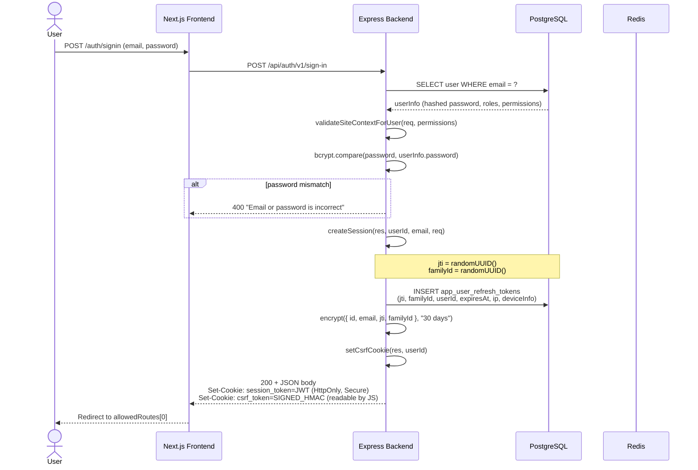
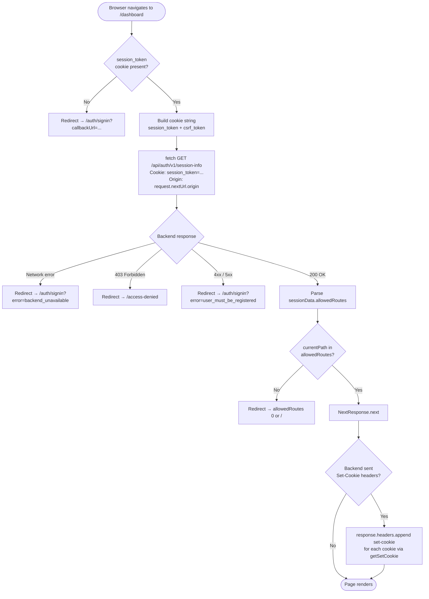
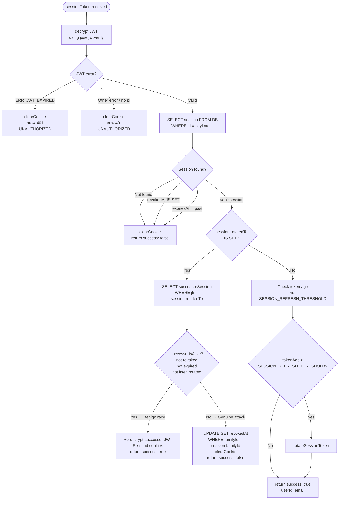
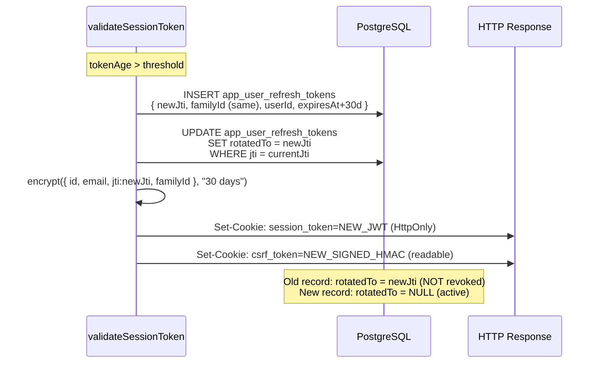
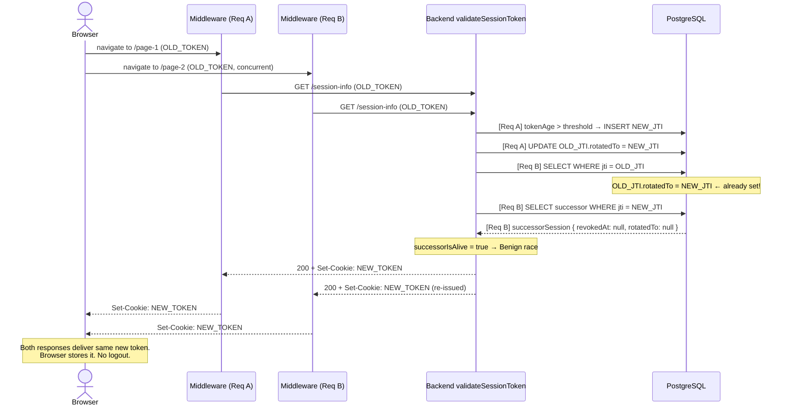
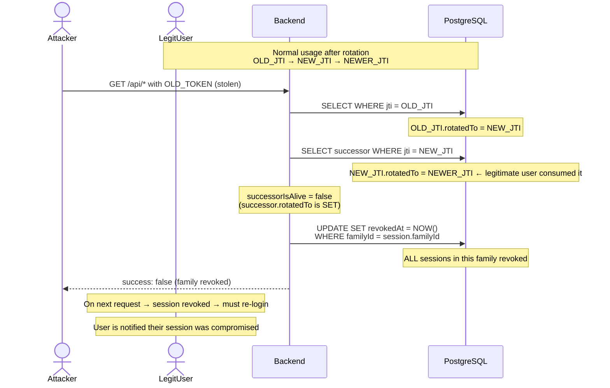
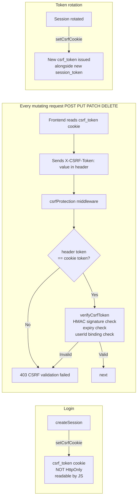
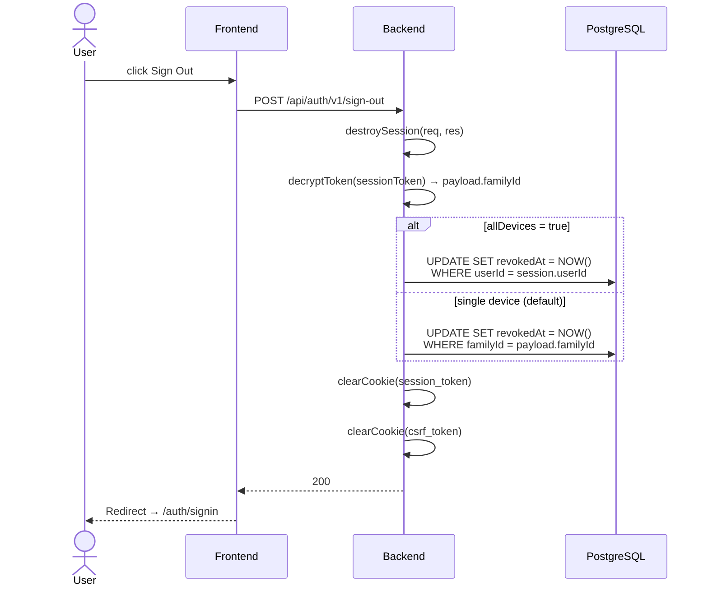

# Session Authentication Flow

Technical reference for the single-token session system used across the backend API and Next.js middleware.

---

## Overview

The system uses a **single encrypted session token** stored in an `HttpOnly` cookie. There are no separate access/refresh token pairs. Sessions are tracked in the database (`app_user_refresh_tokens` table), which allows server-side revocation, replay detection, and sliding-window renewal.

### Key constants

| Constant                    | Default                 | Description                      |
| --------------------------- | ----------------------- | -------------------------------- |
| `SESSION_TOKEN_AGE`         | `30 days`               | JWT expiry embedded in the token |
| `SESSION_COOKIE_MAX_AGE`    | `30 days`               | Cookie `Max-Age` attribute       |
| `SESSION_REFRESH_THRESHOLD` | `1 hour` (1 min in dev) | Age after which token is rotated |
| `CSRF_TOKEN_EXPIRY`         | `24 hours`              | CSRF cookie lifetime             |

---

## 1. Sign-in Flow



---

## 2. Accessing a Protected Route (Next.js Middleware)

Every request matching the middleware `matcher` config goes through this flow before the page renders.



---

## 3. Session Validation (Backend `validateSessionToken`)

This runs on every authenticated endpoint, including `GET /session-info` called by the Next.js middleware.



---

## 4. Session Rotation (Sliding Window)

Triggered when the token's age exceeds `SESSION_REFRESH_THRESHOLD`.



The old record is **not revoked** — it is only marked `rotatedTo`. This is intentional: it allows the benign race detection to verify the successor is still alive.

---

## 5. Rotation Race Condition and Grace Period

When the Next.js middleware fires `GET /session-info` concurrently (e.g. two navigations within milliseconds), Request A rotates the session and writes `rotatedTo` to the DB before its own response returns the new cookie to the browser. Request B, using the same old token, hits the `rotatedTo` check.



### Genuine replay attack path



---

## 6. CSRF Protection

Uses the **Double-Submit Cookie Pattern**.



**Token format:** `timestamp.random.userId.hmacSignature`

- `timestamp` — used to enforce 24-hour expiry
- `userId` — bound to the authenticated user, prevents token swapping between accounts
- `hmacSignature` — HMAC-SHA256 signed with `CSRF_SECRET`, truncated to 32 hex chars

---

## 7. Sign-out Flow



---

## 8. Session DB Schema

```
app_user_refresh_tokens
─────────────────────────────────────────
jti          UUID  PRIMARY KEY   ← unique token ID (stored in JWT)
familyId     UUID  NOT NULL      ← groups all rotations from one login
userId       UUID  NOT NULL FK
expiresAt    TIMESTAMP NOT NULL
revokedAt    TIMESTAMP NULL      ← set on logout or attack detection
rotatedTo    UUID NULL           ← jti of successor token after rotation
ip           TEXT
deviceInfo   JSONB               ← os, browser, device, engine
createdAt    TIMESTAMP DEFAULT NOW()
```

### State machine for a single session record

```
 [ACTIVE]
    │
    ├─ token age > threshold ──→ rotatedTo = NEW_JTI  →  [ROTATED]  (successor created)
    │
    ├─ logout ─────────────────→ revokedAt = NOW()    →  [REVOKED]
    │
    └─ attack detected ─────────→ revokedAt = NOW()   →  [REVOKED]
       (all family members)
```

Only records where `rotatedTo IS NULL AND revokedAt IS NULL AND expiresAt > NOW()` are considered active (used by `getActiveSessions`).

---

## 9. Cookie Attributes Reference

| Cookie          | HttpOnly                 | SameSite (dev) | SameSite (prod) | Secure    | Domain (prod)  |
| --------------- | ------------------------ | -------------- | --------------- | --------- | -------------- |
| `session_token` | ✅                       | `Lax`          | `None`          | prod only | `.example.com` |
| `csrf_token`    | ❌ (must be JS-readable) | `Lax`          | `Strict`        | prod only | `.example.com` |

`session_token` uses `SameSite=None` in production because the frontend (`example.com`) and backend API (`api.example.com`) are on different subdomains — a cross-site context. `Secure` is required when `SameSite=None`.

`csrf_token` uses `SameSite=Strict` because it only needs to be readable by the same-origin JS, and strict provides stronger CSRF protection for the cookie itself.
