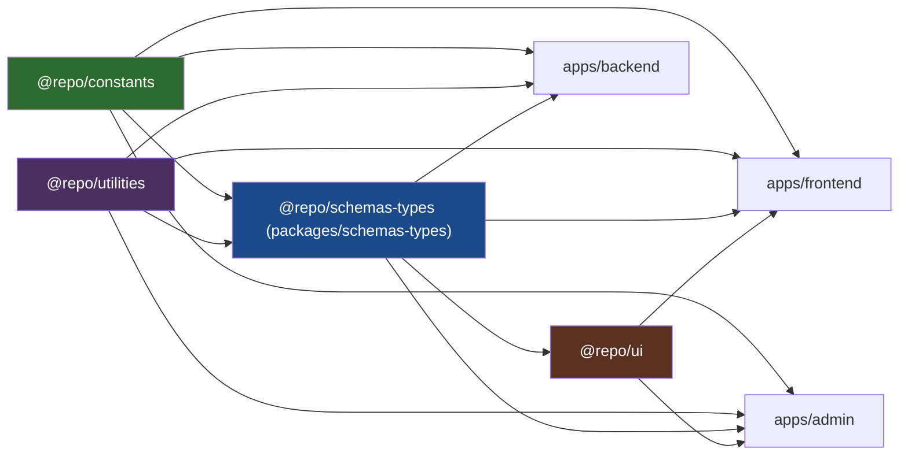
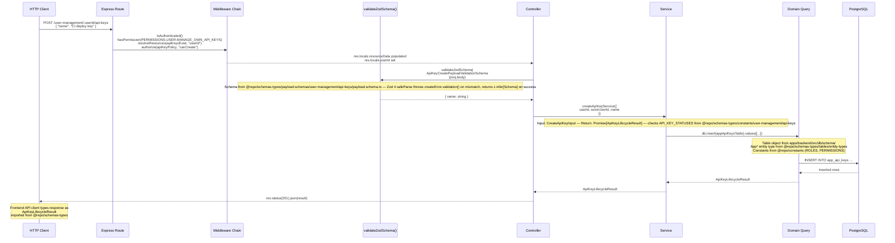
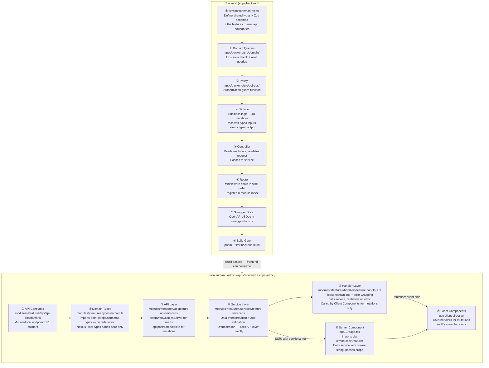

# Type & Validation Schema Flow — Starter Monorepo

---

## 1. Package Dependency Graph

Build order and dependency direction between all shared packages and apps.




**Build order:** `@repo/constants` → `@repo/utilities` → `@repo/schemas-types` → `apps/backend` → `apps/frontend` / `apps/admin`

> Package import alias: `@repo/schemas-types` (lives at `packages/schemas-types`).

> `@repo/ui` has no build step for type-checking — consumed as source via package exports wildcard.

---

## 2. Type & Schema Architecture

End-to-end picture of where types originate, how they compose, and how each layer consumes them.

> The `user-management/api-keys` boxes below are a hypothetical, not-yet-built feature — `apps/frontend` and `apps/admin` currently only ship `auth/` and `common/` modules. They illustrate the shape a new cross-boundary feature takes; every other box (`auth`, `admin`, `common`) reflects the real, current contents of `@repo/schemas-types`.

```mermaid
flowchart TD
    DB[("PostgreSQL")]

    subgraph BE_SCHEMA ["apps/backend/src/db/schema/"]
        BE_TABLES["Drizzle table objects\nappUsersTable\nappRolesTable\nappPermissionsTable ...\nUsed for queries and migrations only"]
    end

    subgraph PKG_SCHEMAS ["@repo/schemas-types  ·  packages/schemas-types/src/"]
        TABLES["📋 tables/entity-types.ts\n─────────────────────────────\n9 App* entity row types\nAppUsers, AppRoles, AppPermissions\nAppEmailVerificationTokens, AppActivityLogs ...\n\ntype AppUsers = typeof appUsersTable.$inferSelect"]

        CONSTS["🔢 constants/\n─────────────────────────────\npagination.ts\n  MAX_PAGINATION_LIMIT = 100\n\ntimezones.ts\n  UTC_OFFSETS (57 values)  ·  UtcOffset\n\nuser-management/api-keys.ts   (hypothetical — see §7)\n  API_KEY_STATUSES (3 values)\n  REVOKE_ELIGIBLE_STATUSES\n  API_KEY_SORTABLE_FIELDS\n  API_KEY_FILTERABLE_FIELDS\n  API_KEY_SELECTABLE_FIELDS"]

        subgraph PS ["payload-schemas/  (Zod request schemas + TypeScript response types ONLY)"]
            PS_COMMON["common/\napi-types.schema.ts\n  ApiResponse[T] (discriminated union — canonical)\n  ApiPaginationMeta\nResponse.type.ts\n  backward-compat shim — re-exports ApiResponse\n  ApiSuccessResponse[T], ApiErrorResponse aliases\npayload.schema.ts\n  paginationQuerySchema\n  resourceIdValidationSchema\nsearch-location/payload.schema.ts\n  city/state/country search request schemas"]

            PS_AUTH["auth/\nPayload.schema.ts\n  Zod: SignupPayload, SigninPayload\n       ForgotPasswordRequest, ResetPassword\n       EmailVerification, VerifyEmailCode\nResponse.type.ts\n  TS:  SafeUser, AuthSessionData\n       AuthSignInData, UserInfoPayload\n       PermissionMap"]

            PS_ADMIN["admin/**/\nroles/payload.schema.ts\n  AdminCreateRolePayloadValidationSchema\npermissions/payload.schema.ts\n  AdminCreatePermissionPayloadValidationSchema\nlanguages/payload.schema.ts\n  AdminCreateLanguagePayloadValidationSchema"]

            PS_USER_MGMT["user-management/api-keys/**  (hypothetical — no module yet)\npayload.schema.ts\n  ApiKeyCreatePayloadValidationSchema\n  ApiKeyRevokePayloadValidationSchema\nresponse.schema.ts\n  ApiKeyResponseType = ApiResponse[T]\n  ApiKeyListResponse = ApiResponse[T]"]
        end
    end

    subgraph SHARED ["Shared Packages"]
        REPO_CONST["@repo/constants\n─────────────────────────────\nROLES · PERMISSIONS\nUSER_ORIGIN_TYPES\nSELF_REGISTRABLE_ROLES · ADMIN_ROLES"]

        REPO_UTIL["@repo/utilities\n─────────────────────────────\nfetch-with-cookies\nfetch-with-cookies-server\nsanitize-html wrappers"]

        REPO_UI["@repo/ui\n─────────────────────────────\nShared React components\n(imports App* prop types\nfrom @repo/schemas-types/tables/)"]
    end

    subgraph BE ["apps/backend"]
        B_ROUTE["Route  ·  *.routes.ts\nisAuthenticated\nhasPermission\nresolveResources\nauthorize\ncontroller"]

        B_VALID["validateZodSchema(Schema)(data)\nthrows createError.validation() on mismatch\nreturns z.infer[Schema] on success"]

        B_CTRL["Controller\nreads res.locals.resourceData\nprepares typed inputs for service"]

        B_SVC["Service\nPromise[ResponseType]\nbusiness logic + state transitions"]

        B_DOMAIN["Domain Queries / Commands\nDrizzle SELECT / INSERT / UPDATE\nimports table objects from @/db/schema"]
    end

    subgraph FE ["apps/frontend  +  apps/admin"]
        F_API["API service layer\nfetch / axios\ntyped with @repo/schemas-types response types\nErrorWithStatus for error branches"]

        F_FORMS["Form layer\nreact-hook-form\n+ zodResolver(ZodSchema)"]

        F_COMP["React Components\n(Server Components by default\n Client only for interactivity)"]
    end

    %% ── Database ─────────────────────────────────────────────────────────────
    DB <-->|"SQL"| B_DOMAIN
    BE_TABLES -->|"Drizzle queries\nSELECT / INSERT / UPDATE"| B_DOMAIN

    %% ── tables/ → entity-types ───────────────────────────────────────────────
    %% (packages/schemas-types/src/tables/ holds its own Drizzle-compatible defs
    %%  separate from apps/backend/src/db/schema to avoid circular deps)
    TABLES -->|"App* types for\nPick/Omit response shapes"| PS_COMMON
    TABLES -->|"appUsersSchema.shape\nfor Zod field composition\n+ App* response types"| PS_AUTH
    TABLES -->|"App* response types"| PS_ADMIN
    TABLES -->|"App* response types (hypothetical)"| PS_USER_MGMT
    TABLES -->|"App* prop types\nfor component generics"| REPO_UI
    TABLES -->|"App* domain types\nfor query result shapes"| B_DOMAIN

    %% ── External deps → payload-schemas ──────────────────────────────────────
    REPO_CONST -->|"z.enum() constant values\nused in Zod request schemas"| PS_COMMON
    REPO_CONST -->|"z.enum() constant values"| PS_AUTH
    REPO_UTIL  -->|"sanitize-html transforms\nin Zod field pipelines"| PS_AUTH
    REPO_UTIL  -->|"sanitize-html transforms"| PS_USER_MGMT

    %% ── schemas/constants → payload-schemas ──────────────────────────────────
    CONSTS -->|"MAX_PAGINATION_LIMIT\nin paginationQuerySchema"| PS_COMMON

    %% ── payload-schemas → backend ────────────────────────────────────────────
    PS_COMMON -->|"Zod schemas\nfor request validation"| B_VALID
    PS_AUTH   -->|"Zod schemas"| B_VALID
    PS_ADMIN  -->|"Zod schemas"| B_VALID
    PS_USER_MGMT -->|"Zod schemas (hypothetical)"| B_VALID

    PS_COMMON -->|"TS response types\nfor service return annotations"| B_SVC
    PS_ADMIN  -->|"TS response types"| B_SVC
    PS_USER_MGMT -->|"TS response types (hypothetical)"| B_SVC

    CONSTS -->|"SORTABLE / SELECTABLE\nFILTERABLE field arrays\nused in controller query composition"| B_CTRL
    CONSTS -->|"API_KEY_STATUSES (hypothetical)\nfor service business logic guards"| B_SVC
    REPO_CONST -->|"ROLES, PERMISSIONS\nfor RBAC checks"| B_DOMAIN

    %% ── Backend internal flow ─────────────────────────────────────────────────
    B_ROUTE --> B_VALID
    B_VALID --> B_CTRL
    B_CTRL  --> B_SVC
    B_SVC   --> B_DOMAIN

    %% ── payload-schemas → frontend/admin ─────────────────────────────────────
    PS_COMMON -->|"ErrorWithStatus\nApiSuccessResponse[T]\nfor typed API responses"| F_API
    PS_AUTH   -->|"TS response types"| F_API
    PS_ADMIN  -->|"TS response types"| F_API
    PS_USER_MGMT -->|"TS response types (hypothetical)"| F_API

    PS_AUTH   -->|"Zod schemas\nzodResolver for forms"| F_FORMS
    PS_ADMIN  -->|"Zod schemas"| F_FORMS
    PS_USER_MGMT -->|"Zod schemas (hypothetical)"| F_FORMS

    CONSTS     -->|"status values\nfor UI display logic"| F_COMP
    REPO_CONST -->|"ROLES, PERMISSIONS\nfor permission-gated UI"| F_COMP
    F_API   --> F_COMP
    F_FORMS --> F_COMP
    REPO_UI --> F_COMP
```



---

## 3. Request / Response Lifecycle

A single protected endpoint traced end-to-end, using `POST /user-management/:userId/api-keys` as the example (hypothetical — this endpoint doesn't exist yet; the trace shows the shape a real one takes).



---

## 4. `@repo/schemas-types` Internal Structure

```
packages/schemas-types/src/
│
├── tables/                          Drizzle-compatible table defs → $inferSelect entity types
│   ├── entity-types.ts              Central re-export hub for all 9 App* types
│   ├── index.ts
│   ├── user-management/             AppUsers, AppRoles, AppPermissions,
│   │                                AppEmailVerificationTokens
│   └── common-tables/               AppCountries, AppStates, AppCities,
│                                    AppLanguages, AppTimezones, AppActivityLogs
│
├── constants/                       Pure runtime values — no Zod, no DB-derived types
│   ├── pagination.ts                MAX_PAGINATION_LIMIT = 100
│   ├── timezones.ts                 UTC_OFFSETS (57 strings)  ·  UtcOffset type
│   └── user-management/             (hypothetical — no module yet, see §7)
│       └── api-keys.ts              API_KEY_STATUSES (3-value const object)
│                                    ApiKeyStatus (type alias)
│                                    REVOKE_ELIGIBLE_STATUSES  (2-item array)
│                                    API_KEY_SORTABLE_FIELDS
│                                    API_KEY_FILTERABLE_FIELDS
│                                    API_KEY_SELECTABLE_FIELDS (6 fields)
│
└── payload-schemas/                 Zod request schemas + TypeScript response types ONLY
    ├── common/
    │   ├── api-types.schema.ts      ApiResponse<T>  ← CANONICAL — import from here
    │   │                            (discriminated union: success/error branches)
    │   │                            ApiPaginationMeta
    │   ├── Response.type.ts         Backward-compat shim — re-exports ApiResponse<T>
    │   │                            ApiSuccessResponse<T>, ApiErrorResponse (aliases)
    │   │                            PAGINATION (offset-based legacy pagination)
    │   ├── payload.schema.ts        paginationQuerySchema (uses MAX_PAGINATION_LIMIT)
    │   │                            resourceIdValidationSchema
    │   │                            incomingRequestValidationSchema()
    │   │                            LabeledCountSchema
    │   └── search-location/
    │       └── payload.schema.ts    city/state/country search request schemas
    │
    ├── auth/
    │   ├── Payload.schema.ts        Zod: SignupPayload, SigninPayload
    │   │                                  ForgotPasswordRequest, ResetPassword
    │   │                                  EmailVerification, VerifyEmailCode
    │   └── Response.type.ts         TS:  SafeUser, AuthSessionData
    │                                     AuthSignInData, UserInfoPayload
    │                                     PermissionMap
    │
    ├── admin/
    │   ├── roles/payload.schema.ts
    │   │                            AdminCreateRolePayloadValidationSchema
    │   ├── permissions/payload.schema.ts
    │   │                            AdminCreatePermissionPayloadValidationSchema
    │   └── languages/payload.schema.ts
    │                                AdminCreateLanguagePayloadValidationSchema
    │
    └── user-management/             (hypothetical — no module yet, see §7)
        └── api-keys/
            ├── payload.schema.ts    ApiKeyCreatePayloadValidationSchema
            │                        ApiKeyRevokePayloadValidationSchema
            │                        ApiKeyListParams
            └── response.schema.ts   ApiKeyResponseType = ApiResponse<T>
                                     ApiKeyListResponse = ApiResponse<T>
```

---

## 5. Constants: Two Sources, Different Scopes

| | `@repo/constants` | `@repo/schemas-types/constants/` |
|---|---|---|
| **Scope** | Business-domain enums used across all apps | Schema-local values used by payload-schemas and backend |
| **Contents** | `ROLES`, `PERMISSIONS`, `USER_ORIGIN_TYPES`, `SELF_REGISTRABLE_ROLES`, `ADMIN_ROLES` | `MAX_PAGINATION_LIMIT`, `UTC_OFFSETS`, `API_KEY_STATUSES` (hypothetical), `SORTABLE/FILTERABLE/SELECTABLE_FIELDS` |
| **Used in Zod schemas** | Yes — `z.enum()` validators in payload-schemas | Yes — `MAX_PAGINATION_LIMIT` in `paginationQuerySchema` |
| **Used in backend services** | Yes — RBAC checks, resource-owner resolution | Yes — status lifecycle guards, field selection |
| **Used in frontend/admin** | Yes — permission-gated UI, role checks | Yes — status display labels |

---

## 6. Key Architectural Rules

| Rule | Detail |
|---|---|
| **Single source of truth** | `@repo/schemas-types` is the only package that may define types crossing app boundaries. |
| **No duplication** | Entity types derive from Drizzle `$inferSelect` — never manually re-declared in apps or packages. |
| **payload-schemas = types only** | Only Zod request schemas and TypeScript response types. No runtime constants, no DB-specific logic. |
| **Constants separation** | `@repo/constants` → business-domain constants. `@repo/schemas-types/constants/` → schema-local values (pagination, field arrays, status values). |
| **App-local types stay local** | Next.js-specific types (`SearchParams`, `PageProps`) are defined per-file in frontend/admin — not pushed into `@repo/schemas-types`. |
| **Features directory** | All frontend/admin feature code lives in `modules/<feature-name>/`. The `app/` directory holds only layouts and pages. Pages import via `@modules/<feature-name>/...`. |
| **@modules alias** | `@modules/*` resolves to `./modules/*` in both `apps/frontend` and `apps/admin` tsconfig paths. Use it for all page→feature and cross-feature imports. |
| **Controller reads locals** | Controllers read pre-resolved resource data from `res.locals.resourceData`, not from `req.params`/`req.body`, after the middleware chain has run. |
| **Services never re-fetch** | Services receive pre-computed inputs from controllers and only perform mutations — no redundant existence checks for data already resolved by `resolveResources`. |
| **No barrel re-exports from `@repo/schemas-types`** | `validations/schemas.ts` and `types/domain.ts` are for custom/local code only. Never re-export schemas or types from `@repo/schemas-types` through any module file — import directly at the call site. |
| **No `as` alias on `@repo/schemas-types` imports** | Never rename a schema or type when importing from `@repo/schemas-types`. Use the canonical exported name exactly as defined in the package at every import site. |
| **`ApiResponse<T>` is the canonical response wrapper** | All `_api/*.ts` functions must return `Promise<ApiResponse<T>>`. Import `ApiResponse` from `@repo/schemas-types/payload-schemas/common/api-types.schema` — never redefine a custom `{ success: boolean; data?: T; message: string }` shape. |
| **Discriminated union narrowing required** | `ApiResponse<T>` is a discriminated union — `data` only exists on the success branch. Always narrow with `if (response.success)` before accessing `.data`. Never use `response.data?.field`. |
| **`ApiResponse<null>` for mutations with no payload** | When an endpoint returns only a success/error signal (no data), the return type is `ApiResponse<null>`. Service layer functions may discard this and return `Promise<void>` by `await`-ing instead of `return`-ing. |
| **`response.message ?? ''`** | `message` on the success branch of `ApiResponse<T>` is `string \| undefined`. Use `response.message ?? ''` when the caller expects `string`. |
| **`createApiError` for throwing in API services** | When an API call fails (`!response.ok \|\| !data.success`), throw via `createApiError(message, status)` from `@repo/utilities/errors/error-parsing`. This attaches `.status`/`.statusCode` so `handleErrorToast` can format 422 errors as bullet lists. |
| **Auth endpoint exception** | Auth endpoints use `AuthSuccessResponse<TData, TLinks>` from `@repo/schemas-types/payload-schemas/auth/` — they carry an optional `token` and `_links` field not present in `ApiResponse<T>`. Do not simplify these to `ApiResponse<T>`. |
| **`_links` optional on success branch** | The success branch of `ApiResponse<T>` includes `_links?: Record<string, unknown>` for HATEOAS routes that return hypermedia links (e.g. post-auth redirect targets). Access via `if (response.success && response._links)`. |

---

## 7. Full-Stack Feature Implementation Guide

Step-by-step reference for implementing a new feature end-to-end following this monorepo's architecture. There is no filled-in reference module for this in the trimmed-down template yet — `apps/frontend` and `apps/admin` currently ship only `auth/` and `common/`. Use a hypothetical `user-management/api-keys` feature (a user managing their own API keys) as the canonical walkthrough; every file/type name below is illustrative.

### 7.1 Implementation Order



---

### 7.2 Backend: Step-by-Step

#### Step 1 — Add shared types to `@repo/schemas-types`

Create (or extend) files in `packages/schemas-types/src/payload-schemas/<domain>/<feature>/`.

```
packages/schemas-types/src/payload-schemas/<domain>/<feature>/
├── payload.schema.ts   ← Zod request schemas + inferred TS types
└── response.schema.ts  ← TypeScript response types (no Zod needed here)
```

**`payload.schema.ts`** — request validation + response types:

```typescript
// packages/schemas-types/src/payload-schemas/<domain>/<feature>/payload.schema.ts
import z from "zod";
import sanitizeHtml from "sanitize-html";
import { paginationQuerySchema, incomingRequestValidationSchema } from "../../common/payload.schema";

// ─── Request Zod schemas ───────────────────────────────────────────────────

export const FeatureCreatePayloadValidationSchema = z.object({
    name: z.string()
        .min(1, { message: "Name is required" })
        .max(255, { message: "Name cannot exceed 255 characters" })
        .trim()
        .transform((val) => sanitizeHtml(val)),
});
export type FeatureCreatePayloadType = z.infer<typeof FeatureCreatePayloadValidationSchema>;

export interface FeatureListParams extends z.infer<ReturnType<typeof incomingRequestValidationSchema>> {
    userId: string;
    status?: string;
}

// ─── Response TypeScript types ─────────────────────────────────────────────
// (import App* entity types from ../../tables/entity-types when needed for Pick/Omit)

export interface FeatureItemResponse {
    id: string;
    name: string;
    userId: string;
    // Status-like fields are `{ value, label }`, not a plain string — `label`
    // is the single source of truth for display text; the frontend must
    // render it directly, not keep its own copy.
    status: { value: string; label: string };
    createdAt: Date;
}

export interface FeatureListResponse {
    success: true;
    // Every response in this codebase carries `message` — success or error,
    // list or mutation. Do not omit it for GET list endpoints.
    message: string;
    // Same offset-based shape every paginated list endpoint returns
    // (see `PAGINATION` in `common/Response.type.ts`) — totalItems/totalPages
    // are always computed, no opt-out flag.
    pagination: {
        limit: number;
        offset: number;
        totalItems: number;
        totalPages: number;
    };
    // Filter-count arrays nest under `counts: { ... }` (one named array per
    // filter dimension). Each array entry is `{ value, label, count }`
    // (shared `LabeledCount` type from `common/payload.schema.ts`).
    counts: {
        statusSummary: { value: string; label: string; count: number }[];
    };
    data: FeatureItemResponse[];
}
```

> **When to add constants to `@repo/schemas-types/constants/`:** if the feature introduces sortable/filterable/selectable field arrays or domain-specific status values that are referenced in both the Zod schema and backend services, add them to `packages/schemas-types/src/constants/<domain>/<feature>.ts`.

---

#### Step 2 — Domain query file (existence check + read queries)

Location: `apps/backend/src/domain/<domain>/<subdomain>/models/<feature>-queries.model.ts`

```typescript
// apps/backend/src/domain/<domain>/<subdomain>/models/<feature>-queries.model.ts
import { db } from "@/db/db";
import { appFeatureTable } from "@/db/schema";
import { ExistenceCheckResult } from "@/middleware/resolve-resource.middleware";
import { and, eq, inArray } from "drizzle-orm";
import type { FeatureListParams } from "@repo/schemas-types/payload-schemas/<domain>/<feature>/payload.schema";

// ─── Existence check (required by resolveResources middleware) ─────────────

export type FeatureResolverData = {
    id: string;
    userId: string;
    status: string;
};

export const featureItemsExist = async (
    ids: string[],
    dbOrTx: unknown = db,
): Promise<ExistenceCheckResult<FeatureResolverData>> => {
    const executor = dbOrTx as typeof db;

    const records = await executor
        .select({
            id: appFeatureTable.id,
            userId: appFeatureTable.userId,
            status: appFeatureTable.status,
        })
        .from(appFeatureTable)
        .where(inArray(appFeatureTable.id, ids));

    const foundIds = new Set(records.map((r) => r.id));
    const missingIds = ids.filter((id) => !foundIds.has(id));

    if (missingIds.length > 0) {
        return { success: false, missingIds, resources: [] };
    }

    return {
        success: true,
        missingIds: [],
        resources: records.map((record) => ({
            resourceId: record.id,
            userId: record.userId,
            data: record,
        })),
    };
};

// ─── Read queries ──────────────────────────────────────────────────────────

export const getFeatureList = async (
    { userId, limit, offset, search }: FeatureListParams,
    dbOrTx: unknown = db,
) => {
    const executor = dbOrTx as typeof db;

    const items = await executor
        .select()
        .from(appFeatureTable)
        .where(and(eq(appFeatureTable.userId, userId)))
        .limit(limit)
        .offset(offset);

    return { success: true as const, data: items };
};
```

> Rule: select **only the fields** controllers and policies will actually use — no `select *`. Also note `ExistenceCheckResult<T>` is `{ success, missingIds, resources: BulkResourceData<T>[] }` — there is no resource-owner-type discriminator field; ownership is just `userId` (or `organizationId` when the resource genuinely belongs to a multi-tenant boundary — see `BulkResourceData` in `resolve-resource.middleware.ts`).

---

#### Step 3 — Policy function

Location: `apps/backend/src/policies/<domain>.policy.ts` (add to existing policy file or create new one)

```typescript
// apps/backend/src/policies/<domain>.policy.ts
import { allow, deny, AuthorizationResult, PolicyContext } from "@/policies/base.policy";

export const canCreateFeature = async (
    context: PolicyContext,
    _resourceId: string,
): Promise<AuthorizationResult> => {
    // User-scoped: actor must be the resource owner
    if (context.userId !== context.resourceOwnerId) {
        return deny("You do not have permission to create this resource");
    }
    return allow();
};

export const canModifyFeature = async (
    context: PolicyContext,
    _resourceId: string,
): Promise<AuthorizationResult> => {
    if (context.userId !== context.resourceOwnerId) {
        return deny("You do not have permission to modify this resource");
    }
    return allow();
};

export const featurePolicy = { canCreateFeature, canModifyFeature };
```

> `context.resourceOwnerId` is set automatically by `authorize` middleware from `res.locals.resourceData[n].userId`. Use `context.resourceOwnerOrganizationId` instead when the resource is scoped to a multi-tenant boundary rather than a single user.

---

#### Step 4 — Service

Location: `apps/backend/src/modules/<domain>/features/<feature>/services/create-<feature>.service.ts`

```typescript
// apps/backend/src/modules/<domain>/features/<feature>/services/create-feature.service.ts
import { db } from "@/db/db";
import { appFeatureTable } from "@/db/schema";
import { createError } from "@/middleware/error.middleware";
import type { FeatureItemResponse } from "@repo/schemas-types/payload-schemas/<domain>/<feature>/payload.schema";

// Services define their own input interface — not imported from controllers
export interface CreateFeatureInput {
    userId: string;
    actorUserId: string;
    name: string;
}

export const createFeatureService = async (
    input: CreateFeatureInput,
): Promise<FeatureItemResponse> => {
    const { userId, actorUserId, name } = input;

    const [inserted] = await db
        .insert(appFeatureTable)
        .values({
            userId,
            createdBy: actorUserId,
            name,
        })
        .returning();

    if (!inserted) {
        throw createError.internal("Failed to create feature item");
    }

    return {
        id: inserted.id,
        name: inserted.name,
        userId: inserted.userId,
        createdAt: inserted.createdAt,
    };
};
```

> Services **never** re-read data that `resolveResources` already fetched. They receive pre-validated, pre-filtered inputs from the controller.

---

#### Step 5 — Controller

Location: `apps/backend/src/modules/<domain>/features/<feature>/controllers/create-<feature>.controller.ts`

```typescript
// controllers/create-feature.controller.ts
import { Request, Response } from "express";
import { asyncHandler } from "@/utils/async-handler";
import { validateZodSchema } from "@/middleware/validation.middleware";
import { BulkResourceData } from "@/middleware/resolve-resource.middleware";
import { getUserIdFromAuth } from "@/modules/auth/auth.utils";
import { createFeatureService } from "../services/create-feature.service";
import { FeatureCreatePayloadValidationSchema } from "@repo/schemas-types/payload-schemas/<domain>/<feature>/payload.schema";

export const createFeatureController = asyncHandler(
    async (req: Request, res: Response) => {
        // 1. Read pre-resolved resource data (set by resolveResources middleware)
        const resources = res.locals.resourceData as BulkResourceData<{ userId: string }>[];
        const userId = resources[0]!.userId as string;
        const actorUserId = getUserIdFromAuth(res);

        // 2. Validate + sanitize request body against Zod schema from @repo/schemas-types
        const { name } = validateZodSchema(FeatureCreatePayloadValidationSchema)(req.body);

        // 3. Call service with typed, pre-computed inputs
        const result = await createFeatureService({ userId, actorUserId, name });

        return res.status(201).json({ success: true, data: result });
    },
);
```

---

#### Step 6 — Route (strict middleware order)

Location: `apps/backend/src/modules/<domain>/features/<feature>/<feature>.routes.ts`

```typescript
// <feature>.routes.ts
import { Router, RequestHandler } from "express";
import { isAuthenticated } from "@/middleware/auth.middleware";
import { hasPermission } from "@/middleware/permission.middleware";
import { resolveResources } from "@/middleware/resolve-resource.middleware";
import { authorize } from "@/middleware/authorize.middleware";
import { PERMISSIONS } from "@repo/constants";
import { featureItemsExist } from "@/domain/<domain>/<subdomain>/models/<feature>-queries.model";
import { featurePolicy } from "@/policies/<domain>.policy";
import { createFeatureController } from "./controllers/create-feature.controller";
import { getFeatureListController } from "./controllers/get-feature-list.controller";

const router = Router({ mergeParams: true });

// ──────────────────────────────────────────────────────────────────────────
// POST /api/<domain>/v1/users/:userId/features
// Middleware order is MANDATORY — never reorder these five steps
// ──────────────────────────────────────────────────────────────────────────
router.post(
    "/",
    isAuthenticated(),
    hasPermission(PERMISSIONS.<DOMAIN>.CREATE_FEATURE, ""),
    resolveResources(featureItemsExist, "userId"),   // source defaults to "params"
    authorize(featurePolicy, "canCreateFeature"),
    createFeatureController as RequestHandler,
);

// For bulk body routes (no :id param):
// resolveResources(featureItemsExist, "ids", { source: "body" })

export default router;
```

> **Middleware order is non-negotiable:** `isAuthenticated → hasPermission → resolveResources → authorize → controller`

Register the router in the module's main index file:
```typescript
// apps/backend/src/modules/<domain>/<domain>.module.ts
import featureRouter from "./features/<feature>/<feature>.routes";
router.use("/users/:userId/features", featureRouter);
```

---

#### Step 7 — Run the build gate

```bash
pnpm --filter backend build
```

Fix any TypeScript errors before moving to the frontend. The build is the source of truth for type correctness.

---

### 7.3 Frontend / Admin: Step-by-Step

Frontend (`apps/frontend`) and admin (`apps/admin`) follow the same pattern. Feature code lives in the top-level `modules/` directory — **not** inside `app/`. Pages and layouts in `app/` import via the `@modules` alias.

```
app/<domain>/<route-segment>/
├── page.tsx                              ← Server Component — imports from @modules/<feature-name>/
├── loading.tsx                           ← Suspense boundary (streaming)
├── error.tsx                             ← Error boundary ("use client")
└── not-found.tsx                         ← Rendered when service returns null

modules/<feature-name>/
├── api/
│   ├── api-constants.ts                  ← Module-local endpoint URL builders
│   └── feature-api-service.ts            ← Raw HTTP: fetchWithCookiesServer for reads, api.post/patch/delete for mutations
├── services/
│   └── feature-service.ts                ← Transformation + Zod validation, orchestration — calls API layer directly
├── handlers/
│   └── feature.handlers.ts               ← Toast + error wrapping, re-throws — called by Client Components for mutations only
├── types/
│   └── domain.ts                         ← Re-exports from @repo/schemas-types, Next.js-local types only
├── hooks/                               ← Custom React hooks (optional)
├── constants/                           ← Module-local constants (optional)
├── utils/                               ← Pure utility functions (optional)
└── components/
    ├── FeatureList.tsx                   ← Server Component (display)
    └── FeatureForm.tsx                   ← Client Component ("use client")
```

**Import rules:**
- Pages/layouts import feature code with `@modules/<feature-name>/...` (never relative `./` from `app/`)
- Within a feature folder, imports stay relative (e.g. `../services/feature-service`)
- Cross-feature imports use `@modules/<other-feature-name>/...`

---

#### Step 1 — API endpoint constants (module-local)

```typescript
// modules/<feature-name>/api/api-constants.ts
// Endpoint URL builders — kept module-local, NOT in @repo/schemas-types
export const FEATURE_ENDPOINTS = {
    LIST:    (userId: string) =>
        `/api/<domain>/v1/users/${userId}/features`,
    CREATE:  (userId: string) =>
        `/api/<domain>/v1/users/${userId}/features`,
    GET_ONE: (userId: string, featureId: string) =>
        `/api/<domain>/v1/users/${userId}/features/${featureId}`,
    DELETE:  (userId: string, featureId: string) =>
        `/api/<domain>/v1/users/${userId}/features/${featureId}`,
} as const;
```

---

#### Step 2 — Domain types (Next.js-local types only — never re-export from `@repo/schemas-types`)

```typescript
// modules/<feature-name>/types/domain.ts
// This file holds Next.js-local types and local composite DTOs ONLY.
// Never re-export types from @repo/schemas-types here — import them directly at the call site.

// Import from @repo/schemas-types only when composing a local DTO
import type { FeatureItemResponse } from "@repo/schemas-types/payload-schemas/<domain>/<feature>/payload.schema";

// Local composite DTO (use when @repo/schemas-types has no direct fit)
export interface TransformedFeatureData {
    items: FeatureItemResponse[];
    hasMore: boolean;
}

// Next.js-specific types (page props, search params) — these stay LOCAL, not in @repo/schemas-types
export type FeatureSearchParams = {
    page?: string;
    limit?: string;
    search?: string;
    status?: string;
};
```

---

#### Step 3 — API service layer (raw HTTP calls)

This is the only layer that makes HTTP requests. Reads use `fetchWithCookiesServer` so the `cookies` string can be forwarded for authenticated SSR. Mutations use the native `fetch` / `fetchWithCookies` client.

All functions return `Promise<ApiResponse<T>>`. On failure, throw via `createApiError(message, status)` from `@repo/utilities/errors/error-parsing` — this attaches `.status`/`.statusCode` so `handleErrorToast` can format 422 errors correctly.

```typescript
// modules/<feature-name>/api/feature-api-service.ts
import { fetchWithCookiesServer } from "@repo/utilities/http/fetch-with-cookies-server";
import { fetchWithCookies } from "@repo/utilities/http/fetch-with-cookies";
import { createApiError } from "@repo/utilities/errors/error-parsing";
import type { ApiResponse } from "@repo/schemas-types/payload-schemas/common/api-types.schema";
import type { FeatureItemResponse } from "@repo/schemas-types/payload-schemas/<domain>/<feature>/payload.schema";
import { FEATURE_ENDPOINTS } from "./api-constants";

// ─── Reads — fetchWithCookiesServer (cookies forwarded for SSR auth) ────────

export async function getFeatureList(
    userId: string,
    params: { page?: string; limit?: string; search?: string } = {},
    cookies?: string,
): Promise<ApiResponse<{ items: FeatureItemResponse[]; total: number }> | null> {
    const searchParams = new URLSearchParams();
    if (params.page)   searchParams.set("page",   params.page);
    if (params.limit)  searchParams.set("limit",  params.limit);
    if (params.search) searchParams.set("search", params.search);

    const url = `${FEATURE_ENDPOINTS.LIST(userId)}?${searchParams.toString()}`;
    const response = await fetchWithCookiesServer(url, cookies);
    if (!response.ok) return null;
    return response.json() as Promise<ApiResponse<{ items: FeatureItemResponse[]; total: number }>>;
}

// ─── Mutations — fetchWithCookies (browser credentials sent automatically) ───

export async function createFeature(
    userId: string,
    payload: { name: string },
): Promise<ApiResponse<FeatureItemResponse>> {
    const response = await fetchWithCookies(
        FEATURE_ENDPOINTS.CREATE(userId),
        { method: "POST", headers: { "Content-Type": "application/json" }, body: JSON.stringify(payload) },
    );
    const data = await response.json() as ApiResponse<FeatureItemResponse>;
    if (!response.ok || !data.success) throw createApiError(data.message || "Failed to create feature", response.status);
    return data;
}

export async function deleteFeature(
    userId: string,
    featureId: string,
): Promise<ApiResponse<null>> {
    const response = await fetchWithCookies(
        FEATURE_ENDPOINTS.DELETE(userId, featureId),
        { method: "DELETE" },
    );
    const data = await response.json() as ApiResponse<null>;
    if (!response.ok || !data.success) throw createApiError(data.message || "Failed to delete feature", response.status);
    return data;
}
```

---

#### Step 4 — Service layer (orchestration + transformation)

Location: `modules/<feature-name>/services/feature-service.ts`

Sits between the API layer and the handler. Handles all business logic — data transformation, Zod validation, composing multiple API calls.

```typescript
// modules/<feature-name>/services/feature-service.ts
import type { FeatureItemResponse } from "@repo/schemas-types/payload-schemas/<domain>/<feature>/payload.schema";
import * as api from "../api/feature-api-service";

export const featureService = {
    async getFeatureList(
        userId: string,
        params: { page?: string; limit?: string; search?: string } = {},
        cookies?: string,
    ): Promise<{ items: FeatureItemResponse[]; total: number } | null> {
        const result = await api.getFeatureList(userId, params, cookies);
        if (!result || !result.success) return null;
        return result.data;  // safe — discriminated union narrowed by `result.success`
    },

    async createFeature(
        userId: string,
        payload: { name: string },
    ): Promise<FeatureItemResponse> {
        const result = await api.createFeature(userId, payload);
        // _api/ already throws on failure via createApiError — result.success is always true here
        return result.data;
    },

    async deleteFeature(
        userId: string,
        featureId: string,
    ): Promise<void> {
        // await (not return) discards ApiResponse<null> and keeps this function Promise<void>
        await api.deleteFeature(userId, featureId);
    },
};
```

> Services throw on error — they never show toasts or touch UI state. That responsibility belongs to the handler layer.

---

#### Step 5 — Handler layer (toast notifications + error wrapping)

Location: `modules/<feature-name>/handlers/feature.handlers.ts`

Thin async wrappers called by **Client Components for mutations only**. The only layer allowed to trigger toasts. Always re-throws so the calling component can react (e.g., reset form, update local state). Server Components call `services/` directly — no handler needed for SSR reads.

```typescript
// modules/<feature-name>/handlers/feature.handlers.ts
import { toast } from "sonner";
import type { FeatureItemResponse } from "@repo/schemas-types/payload-schemas/<domain>/<feature>/payload.schema";
import { featureService } from "../services/feature-service";
import { handleErrorToast } from "@repo/utilities/errors/error-toasts";

export const handleCreateFeature = async (
    userId: string,
    payload: { name: string },
): Promise<FeatureItemResponse> => {
    try {
        const result = await featureService.createFeature(userId, payload);
        toast.success("Feature created successfully");
        return result.data;
    } catch (error) {
        handleErrorToast(error, "Failed to create feature");
        throw error;
    }
};

export const handleDeleteFeature = async (
    userId: string,
    featureId: string,
    onSuccess: () => void,
): Promise<void> => {
    try {
        await featureService.deleteFeature(userId, featureId);
        toast.success("Feature deleted");
        onSuccess();
    } catch (error) {
        handleErrorToast(error, "Failed to delete feature");
        throw error;
    }
};
```

> **Handler rules:** call service → show toast → re-throw. No business logic, no HTTP calls, no direct `api/` imports. SSR reads pass `cookieString` through to the service; mutations omit it.

---

#### Step 6 — Server Component page (calls service with cookie string)

Server Components call the feature's `services/` directly for SSR reads — they pass a `cookieString` so `fetchWithCookiesServer` can include auth cookies. Client Components call `handlers/` for mutations (toast context available in the browser).

```typescript
// app/<domain>/<route-segment>/page.tsx
// No "use client" — this is a Server Component by default (Next.js 15)
import { cookies } from "next/headers";
import { featureService } from "@modules/<feature-name>/services/feature-service";
import FeatureListClient from "@modules/<feature-name>/components/FeatureListClient";

// Next.js 15: params and searchParams are Promises
type PageProps = {
    params: Promise<{ userId: string }>;
    searchParams: Promise<{ page?: string; limit?: string; search?: string }>;
};

export default async function FeaturePage({ params, searchParams }: PageProps) {
    const { userId } = await params;
    const resolvedSearchParams = await searchParams;

    // Forward the browser's cookies so fetchWithCookiesServer can authenticate the request
    const cookieStore = await cookies();
    const cookieString = cookieStore.toString();

    // Server Components call services/ directly — no toast context needed for SSR reads
    // Import path: @modules/<feature-name>/services/feature-service
    const data = await featureService.getFeatureList(userId, resolvedSearchParams, cookieString);

    return (
        <FeatureListClient
            initialData={data}
            userId={userId}
        />
    );
}
```

---

#### Step 7 — Client Components (interactive UI + forms)

Client Components call **handlers**, not services or API functions directly. They own only rendering and local UI state.

**List component with client-side interactions:**

```typescript
// modules/<feature-name>/components/FeatureListClient.tsx
"use client";
import { useState } from "react";
import type { FeatureListResponse, FeatureItemResponse } from "../types/domain";
import CreateFeatureForm from "./CreateFeatureForm";
import { handleDeleteFeature } from "../handlers/feature.handlers";

interface Props {
    initialData: FeatureListResponse | null;
    userId: string;
}

export default function FeatureListClient({ initialData, userId }: Props) {
    const [data, setData] = useState(initialData);

    const onCreated = (newItem: FeatureItemResponse) => {
        setData((prev) =>
            prev ? { ...prev, data: [newItem, ...prev.data] } : prev,
        );
    };

    const onDelete = async (featureId: string) => {
        // Components call handlers — toast + error are handled inside
        await handleDeleteFeature(userId, featureId, () => {
            setData((prev) =>
                prev ? { ...prev, data: prev.data.filter((i) => i.id !== featureId) } : prev,
            );
        });
    };

    return (
        <div>
            <CreateFeatureForm userId={userId} onSuccess={onCreated} />
            {data?.data.map((item) => (
                <div key={item.id}>
                    {item.name}
                    <button onClick={() => onDelete(item.id)}>Delete</button>
                </div>
            ))}
        </div>
    );
}
```

**Form component — Zod schema from `@repo/schemas-types` drives both backend and frontend validation:**

```typescript
// modules/<feature-name>/components/CreateFeatureForm.tsx
"use client";
import { useForm } from "react-hook-form";
import { zodResolver } from "@hookform/resolvers/zod";
// The SAME Zod schema the backend uses to validate req.body — single source of truth
import { FeatureCreatePayloadValidationSchema } from "@repo/schemas-types/payload-schemas/<domain>/<feature>/payload.schema";
import type { FeatureCreatePayloadType, FeatureItemResponse } from "@repo/schemas-types/payload-schemas/<domain>/<feature>/payload.schema";
import { handleCreateFeature } from "../handlers/feature.handlers"; // ← call handler, not API directly

interface Props {
    userId: string;
    onSuccess: (item: FeatureItemResponse) => void;
}

export default function CreateFeatureForm({ userId, onSuccess }: Props) {
    const form = useForm<FeatureCreatePayloadType>({
        resolver: zodResolver(FeatureCreatePayloadValidationSchema),
        defaultValues: { name: "" },
    });

    const onSubmit = async (data: FeatureCreatePayloadType) => {
        try {
            // Handler shows the success toast and throws on error
            const created = await handleCreateFeature(userId, data);
            onSuccess(created);
            form.reset();
        } catch {
            // Toast already shown by handler — component only handles local recovery
        }
    };

    return (
        <form onSubmit={form.handleSubmit(onSubmit)}>
            <input {...form.register("name")} placeholder="Feature name" />
            {form.formState.errors.name && (
                <p>{form.formState.errors.name.message}</p>
            )}
            <button type="submit" disabled={form.formState.isSubmitting}>
                Create
            </button>
        </form>
    );
}
```

---

### 7.4 Import Rules Summary

| What you need | Import from | Never import from |
|---|---|---|
| Zod request validation schema | `@repo/schemas-types/payload-schemas/<domain>/<feature>/payload.schema` | Local app files, `@repo/types` (deleted) |
| TypeScript response type | `@repo/schemas-types/payload-schemas/<domain>/<feature>/response.schema` | Redefining locally as a custom interface |
| Entity row type (App*) | `@repo/schemas-types/tables/entity-types` | `apps/backend/src/db/schema` (backend-internal only) |
| **Base API response wrapper** | `@repo/schemas-types/payload-schemas/common/api-types.schema` → `ApiResponse<T>` | `Response.type` (backward-compat shim) for new code; never redefine locally |
| `ApiSuccessResponse<T>` / `ApiErrorResponse` | `@repo/schemas-types/payload-schemas/common/Response.type` (aliases) | Redefining locally |
| `createApiError` (throwing in API layer) | `@repo/utilities/errors/error-parsing` | Local `new Error(msg)` without status |
| Business-domain constants | `@repo/constants` | Redefining locally |
| Schema-local constants | `@repo/schemas-types/constants/<domain>/<feature>` | Inlining values in app code |
| Feature services/handlers from a page | `@modules/<feature-name>/services/...` or `@modules/<feature-name>/handlers/...` | Relative `./` imports from `app/` into `modules/` |
| Feature code from another feature | `@modules/<other-feature>/types/...` etc. | Relative `../` paths across feature boundaries |
| Fetch utilities | `@repo/utilities/http/fetch-with-cookies` (client) or `fetch-with-cookies-server` (server) | Raw `fetch` without cookie handling |
| Error toast helper | `@repo/utilities/errors/error-toasts` (`handleErrorToast`) | `toast.error(error.message)` directly |
| Shared UI | `@repo/ui` | Copying components across apps |

---

### 7.5 Full-Stack Feature Checklist

**`@repo/schemas-types` (if cross-boundary types are needed)**
- [ ] `payload.schema.ts` created with Zod request schema(s) and inferred TS types
- [ ] Response TypeScript types/interfaces defined (no Zod needed)
- [ ] Constants added to `constants/<domain>/<feature>.ts` if sortable/filterable/selectable fields or status enums are needed
- [ ] `pnpm --filter "@repo/schemas-types" build` passes

**Backend (`apps/backend`)**
- [ ] Domain query file created with `featureItemsExist` returning `ExistenceCheckResult<T>`
- [ ] Existence function selects only fields controllers + policies will use
- [ ] Policy function(s) created using only `PolicyContext` fields
- [ ] Service receives pre-computed inputs, performs mutations only, returns typed response
- [ ] Controller reads from `res.locals.resourceData`, calls `validateZodSchema()`, calls service
- [ ] Route middleware order: `isAuthenticated → hasPermission → resolveResources → authorize → controller`
- [ ] Route registered in module index
- [ ] Swagger docs updated
- [ ] `pnpm --filter backend build` passes

**Frontend / Admin (`apps/frontend` or `apps/admin`)**
- [ ] Feature code created under `modules/<feature-name>/` — **not** inside `app/`
- [ ] `modules/<feature-name>/api/api-constants.ts` defines endpoint URL builders (module-local, not in `@repo/schemas-types`)
- [ ] `modules/<feature-name>/types/domain.ts` contains only Next.js-local types and local composite DTOs — never re-exports from `@repo/schemas-types`; import package types directly at the call site
- [ ] `modules/<feature-name>/api/feature-api-service.ts` raw HTTP only — all functions return `Promise<ApiResponse<T>>` using canonical import from `api-types.schema`
- [ ] `api/` functions use `createApiError(message, status)` from `@repo/utilities/errors/error-parsing` when throwing on failure
- [ ] No custom `{ success: boolean; message: string; data?: T }` interfaces in `api/` files — use `ApiResponse<T>`
- [ ] Mutations with no payload use `Promise<ApiResponse<null>>` in `api/`; service layer may `await` (not `return`) to stay `Promise<void>`
- [ ] All `response.data` accesses are guarded with `if (response.success)` — never `response.data?.field`
- [ ] `response.message ?? ''` used wherever callers expect `string` (success branch `message` is `string | undefined`)
- [ ] `modules/<feature-name>/services/feature-service.ts` orchestration + transformation — calls `api/` directly, throws on error, no toasts, passes `cookies?` through for SSR reads
- [ ] `modules/<feature-name>/handlers/feature.handlers.ts` wraps service calls — `toast.success` on success, `handleErrorToast` + re-throw on error — called by Client Components for mutations
- [ ] Page (`app/.../page.tsx`) is a Server Component — imports service via `@modules/<feature-name>/...`, calls it with cookie string from `next/headers`, passes typed data as props
- [ ] `loading.tsx` added for Suspense streaming boundary
- [ ] `error.tsx` added as Error boundary (`"use client"`)
- [ ] Client Components marked `"use client"` only when interactivity is required — call handlers (not services or API directly)
- [ ] Form components use `zodResolver(ZodSchema)` with the **same** `@repo/schemas-types` Zod schema the backend validates against
- [ ] `pnpm --filter frontend run check-types` (or `admin`) passes

---

## 8. Zod Schema & Type Conventions

This section defines how Zod schemas (runtime values) and TypeScript types (compile-time) are written, named, and consumed identically across every surface — backend, frontend, and admin.

### 8.1 The Value / Type Distinction

A Zod schema has two faces:

| Face | What it is | Used for | Import style |
|---|---|---|---|
| **Schema VALUE** | A `z.ZodObject<...>` runtime object | `zodResolver(Schema)`, `validateZodSchema(Schema)`, `Schema.parse(data)`, `Schema.safeParse(data)` | Regular `import` (not `import type`) |
| **Inferred TYPE** | `z.infer<typeof Schema>` — erased at compile time | Function parameter types, component props, `useForm<T>` generic | `import type` |

**Critical rule:** Only schema VALUES can be passed to `zodResolver` or `validateZodSchema`. If you accidentally use `import type` for the schema, the call will fail at runtime. Types can always use `import type`.

---

### 8.2 Naming Conventions

All schema names follow a single pattern throughout the monorepo:

| Artifact | Naming pattern | Example |
|---|---|---|
| Zod schema VALUE | `<Domain><Feature>PayloadValidationSchema` | `ApiKeyCreatePayloadValidationSchema` |
| Inferred request TYPE | `<Domain><Feature>PayloadType` | `ApiKeyCreatePayloadType` |
| Response interface | `<Domain><Feature>ResponseType` or `<Feature>ApiResponse` | `ApiKeyResponseType` |
| List/paginated response | `<Domain><Feature>ListResponse` | `ApiKeyListResponse` |

**No abbreviation.** Full domain and feature names. The verbosity is intentional — schema VALUES and types must be unambiguous at import sites.

> The real, current `@repo/schemas-types/payload-schemas/admin/roles/payload.schema.ts` follows this same shape: `AdminCreateRolePayloadValidationSchema` (VALUE) with its inferred type suffixed `...SchemaType` rather than `...Type` — check the file you're extending for its exact suffix convention before adding a new export.

---

### 8.3 `payload.schema.ts` File Anatomy

Every schema file in `packages/schemas-types/src/payload-schemas/` follows this structure:

```typescript
// packages/schemas-types/src/payload-schemas/<domain>/<feature>/payload.schema.ts
import z from "zod";
import sanitizeHtml from "sanitize-html";

// ─── Zod request schemas (VALUES) ─────────────────────────────────────────────
// Named: <Domain><Feature>PayloadValidationSchema

export const ApiKeyCreatePayloadValidationSchema = z.object({
    name: z
        .string()
        .min(2, { message: "Name must be at least 2 characters" })
        .max(255, { message: "Name cannot exceed 255 characters" })
        .trim()
        .transform((val) => sanitizeHtml(val)),
});

// ─── Inferred TypeScript types (erased at runtime) ───────────────────────────
// Named: <Domain><Feature>PayloadType

export type ApiKeyCreatePayloadType = z.infer<typeof ApiKeyCreatePayloadValidationSchema>;

// ─── Additional request schemas / types ───────────────────────────────────────

export const ApiKeyRevokePayloadValidationSchema = z.object({
    reason: z.string().max(500).trim().optional(),
});
export type ApiKeyRevokePayloadType = z.infer<typeof ApiKeyRevokePayloadValidationSchema>;

// ─── Response TypeScript types (no Zod needed here) ──────────────────────────
// These are plain TS interfaces — not Zod schemas

export interface ApiKeyResponseData {
    id: string;
    name: string;
    prefix: string;
    lastUsedAt: string | null;
}
```

**Rules for `payload.schema.ts`:**
- All schema constants are `export const`, not `export default`
- Schema VALUE and its inferred TYPE are co-located in the same file
- Response types are plain TypeScript interfaces — never wrapped in Zod unless they're also validated on intake
- `sanitizeHtml` transforms go inside the Zod `.transform()` pipeline, not in the service

---

### 8.4 How Schema Values Flow Across All Surfaces

The same Zod schema VALUE is the single source of validation logic. It is used in three different ways depending on the surface:

```
packages/schemas-types/src/payload-schemas/<domain>/<feature>/payload.schema.ts
  │
  │  ApiKeyCreatePayloadValidationSchema  (VALUE)
  │  ApiKeyCreatePayloadType              (TYPE)
  │
  ├─► apps/backend  ─── controller
  │       validateZodSchema(ApiKeyCreatePayloadValidationSchema)(req.body)
  │       → throws createError.validation() if invalid
  │       → returns ApiKeyCreatePayloadType if valid
  │
  ├─► apps/frontend  ─── form component
  │       useForm<ApiKeyCreatePayloadType>({
  │           resolver: zodResolver(ApiKeyCreatePayloadValidationSchema),
  │       })
  │       → real-time field validation in the browser
  │
  ├─► apps/frontend  ─── service layer (services/)
  │       const data = createApiKeySchema.parse(payload);
  │       → early client-side validation before the HTTP call
  │
  └─► apps/admin  ─── identical to apps/frontend pattern
```

**Effect:** A validation rule (min length, format, sanitization) is written once and enforced identically on all three surfaces. If you change the schema, all three surfaces update at the next `tsc` run.

---

### 8.5 The `validations/schemas.ts` Re-Export Module

This file is reserved for **custom/local** schemas and UI constants only.

**What goes here:**
- UI-only constants (file size limits, display configuration) that are not in `@repo/constants`
- Local Zod schemas for Pattern 4C form state that have no backend equivalent

**What does NOT go here:**
- Any re-exports from `@repo/schemas-types` — schemas from the package are imported directly at the call site
- TypeScript types — import these directly from `@repo/schemas-types` at the call site
- Schemas that belong to other features

```typescript
// modules/<domain>/<feature>/validations/schemas.ts
// For UI-only constants and local Zod schemas ONLY.
// Never re-export schemas from @repo/schemas-types here — import them directly at the call site.

// ─── UI-only constants (not derivable from Zod) ───────────────────────────────
export const UI_LIMITS = {
    MAX_FILE_SIZE: 5 * 1024 * 1024,
    ALLOWED_IMAGE_TYPES: ["image/jpeg", "image/png", "image/webp"],
};

// ─── Local Zod schemas (Pattern 4C only) ─────────────────────────────────────
// Only when the schema is purely UI-side with no backend equivalent
// import z from "zod";
// export const filterSchema = z.object({ search: z.string().optional() });
```

**Consuming in the service layer** — import directly from `@repo/schemas-types`, use canonical name:

```typescript
// modules/<domain>/<feature>/services/api-keys-service.ts
import { ApiKeyCreatePayloadValidationSchema } from "@repo/schemas-types/payload-schemas/user-management/api-keys/payload.schema";
import type { ApiKeyCreatePayloadType } from "@repo/schemas-types/payload-schemas/user-management/api-keys/payload.schema";

function wrapZodError(error: unknown): never {
    if (error instanceof ZodError) throw new Error(error.issues[0]?.message ?? "Validation failed");
    throw error; // re-throw unchanged — preserves .status/.statusCode
}

export async function createApiKey(userId: string, payload: ApiKeyCreatePayloadType) {
    try {
        const data = ApiKeyCreatePayloadValidationSchema.parse(payload);
        return api.createApiKey(userId, data);
    } catch (error) {
        wrapZodError(error);
    }
}
```

**Consuming in a form component** — import directly from `@repo/schemas-types`, use canonical name:

```typescript
// modules/<domain>/<feature>/components/sections/header/HeaderDialog.tsx
"use client";
import { useForm } from "react-hook-form";
import { zodResolver } from "@hookform/resolvers/zod";
import { ApiKeyCreatePayloadValidationSchema } from "@repo/schemas-types/payload-schemas/user-management/api-keys/payload.schema";
import type { ApiKeyCreatePayloadType } from "@repo/schemas-types/payload-schemas/user-management/api-keys/payload.schema";

export function HeaderDialog() {
    const form = useForm<ApiKeyCreatePayloadType>({
        resolver: zodResolver(ApiKeyCreatePayloadValidationSchema),
        defaultValues: { name: "" },
    });
    // ...
}
```

---

### 8.6 Pattern 4C Exception — Local UI-Only Schemas

For Lightweight List-Page modules (Pattern 4C), the form schema is sometimes UI-only — it has no corresponding backend payload schema (e.g., a client-side search filter form or a local toggle group).

In this case, define the schema locally in `validations/<entity>.schema.ts` inside the feature:

```typescript
// modules/<domain>/user-preferences/validations/user-preferences.schema.ts
import z from "zod";

// Local UI-only schema — no backend equivalent, not shared across features
export const userPreferenceFilterSchema = z.object({
    search: z.string().optional(),
    category: z.enum(["notifications", "display", "privacy"]).optional(),
});

export type UserPreferenceFilterValues = z.infer<typeof userPreferenceFilterSchema>;
```

**Rule:** If the schema is ever validated on the backend (i.e., a field's constraint is enforced server-side), it must move to `@repo/schemas-types`. Local schemas are only for pure UI concerns.

---

### 8.7 Anti-Patterns

| Anti-pattern | Why | Fix |
|---|---|---|
| `import type { SomeSchema }` then pass to `zodResolver` | `import type` is erased — `zodResolver(undefined)` at runtime | Use `import { SomeSchema }` (not `import type`) for schema VALUES |
| Redefining a Zod schema locally when one exists in `@repo/schemas-types` | Validation rules drift between frontend and backend | Import the shared schema from `@repo/schemas-types` |
| Re-exporting types from `validations/schemas.ts` | Types belong at the call site, not in the validation barrel | Import types directly from `@repo/schemas-types` |
| Re-exporting schemas from `validations/schemas.ts` | `validations/schemas.ts` is for custom/local code only — `@repo/schemas-types` schemas must be imported directly at the call site | Import schema VALUES directly from `@repo/schemas-types` |
| Re-exporting types or schemas from `types/domain.ts` | `types/domain.ts` is for custom local types only — re-exporting creates an unnecessary indirection layer | Import from `@repo/schemas-types` directly at the call site |
| Using `as` alias on `@repo/schemas-types` imports | Aliasing creates two names for the same thing, breaks text-search for canonical names, and obscures the source-of-truth | Use the exported name exactly as defined in `@repo/schemas-types` at every import site |
| `.parse()` in a handler | Throws a `ZodError` that bypasses `handleErrorToast` formatting | `.parse()` in the service layer only; handler catches and re-wraps |
| `z.infer<Schema>` redefined as a local interface | Duplicate type that can drift from the schema | Use `type X = z.infer<typeof Schema>` co-located with the schema |
| Response interface defined with Zod when it only needs TS | Over-engineering; responses are never re-validated | Plain `interface` for response types; Zod only for request payloads |
